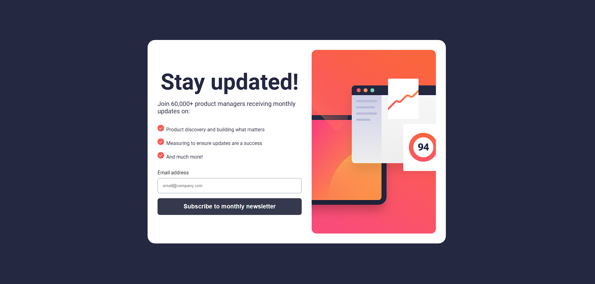
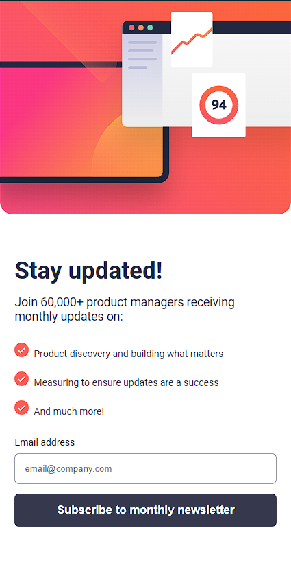

# Frontend Mentor - Newsletter sign-up form with success message solution

This is a solution to the [Newsletter sign-up form with success message challenge on Frontend Mentor](https://www.frontendmentor.io/challenges/newsletter-signup-form-with-success-message-3FC1AZbNrv). Frontend Mentor challenges help you improve your coding skills by building realistic projects.

## Overview

### Screenshot




### Links

- Solution URL: [Add solution URL here](https://newsletter-joeseraphy.vercel.app/)

## My process

### Built with

- Semantic HTML5 markup
- CSS custom properties
- Flexbox
- CSS Grid
- Mobile-first workflow

### What I learned

Desafio junior usando HTML, CSS e javaScript fácil

```html
<div class="text">
  <h1 class="title">Stay updated!</h1>
  <p class="subTitle">
    Join 60,000+ product managers receiving monthly updates on:
  </p>
</div>
<ul class="list">
  <li>Product discovery and building what matters</li>
  <br />
  <li>Measuring to ensure updates are a success</li>
  <br />
  <li>And much more!</li>
</ul>
<form action="#" class="form">
  <div class="labelInp">
    <label class="labelEmail"> Email address</label>
    <span class="error"></span>
    <input type="email" id="email" placeholder="email@company.com" />
  </div>
  <button type="submit" class="btn">Subscribe to monthly newsletter</button>
</form>
```

```css
.proud-of-this-css {
  .container .content .text {
    display: flex;
    flex-direction: column;
    justify-content: center;
    align-items: center;
    gap: 1rem;
    transition: 0.3s;
  }

  .container .content .text .title {
    font-size: 4.5rem;
    font-weight: 700;
    color: var(--DarkSlateGrey);
  }

  .container .content .text .subTitle {
    font-size: 1.25rem;
    color: var(--DarkSlateGrey);
  }
  .container .content .list {
    margin-top: 2rem;
    list-style-image: url(/assets/images/icon-list.svg);
    list-style-position: inside;
  }

  .container .content .list li {
    font-size: 1rem;
    color: var(--DarkSlateGrey);
    top: 1rem;
  }
}
```

### Continued development

Especilizando-se em Reactjs e Web3

## Author

- Website - [Joelson Silva](https://joelson-portfollio.vercel.app/)
- Frontend Mentor - [@JoeSeraphy](https://www.frontendmentor.io/profile/JoeSeraphy)
